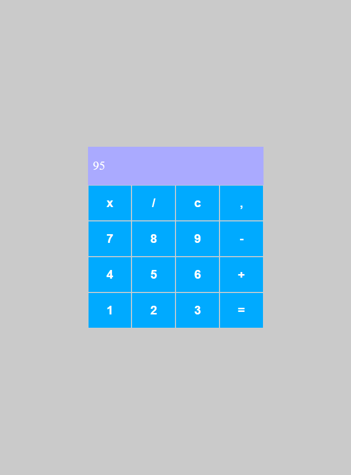

## Calculadora React-Javascript 

    > Projeto desenvolvido puramente com React-js, durante o Bootcamp-Orange-Tech
    disponibilizado pela DIO em parceria com o banco Inter.
    > Desafio de projeto DIO 

## 🌍 Tecnologias

- REACT-JS
- JAVASCRIPT
- AXIOS ( API )
- STYLED-COMPONENTS

## 📚 Contato

Gmail : klayvemguik@gmail.com  
LinkedIn : www.linkedin.com/in/klayvemguimaraes
